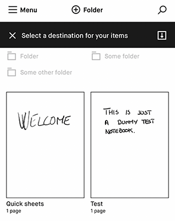

An overview of the solution
===

### Language Used: Python 3.7 (venv)
### IDE used: PyCharm 

As a part of the solution I have created a total of 10 scenarios to test the Move functionality. 
All these scenarios are created using the Behave API in BDD style. 

#### Some terminologies used in this test which would be useful to know beforehand:
1. When the scenario says the files/folders are `ready to move` it implies that the move panel is visible for those files/folders.
2. When the scenario says that for a document/folder `selection header is displayed`, it implies that the document/folder is already selected.

The feature file here has used Given, When, Then, And keywords with the step definition file using the Given, When, Then, Step decorators.

Including the three scenarios required to complete, I have added the following other scenarios:

    1. Long press folder to verify move action is accessable.
    2. Move single file to folder
    3. Move single folder with data to another folder.
    4. Multiple documents can be moved to a different folder.
    5. Multiple folders can be moved to a different folder.
    6. Move file and folder to folder
    7. Move file to folder by searching for destination
    8. All documents can't be moved from library.
    9. All folders can't be moved from library.

Additional object added in `names.py`
---
While testing the scenario `Move single folder with data to another folder` one of my pre-requisite was to make sure that the folder I am moving contains a document. So, before starting the test I added a document to the test to meet my pre-condition. 

When I added the document to the folder I have to _go back_ to the _My Files_ page to start the test. I noted that in the mobile application there is a back button in the top menu to go back to the _My Files_ page. 
I couldn't find any object for that back button in the top menu under `names.py`, so I added the following line of code in `names.py`:

`topMenu_back = {"container": application_window, "id": "backButton", "type": "RMIconButton"}`

Additional methods added in `library_helper.py`
---
I have added the following methods in the `library_helper.py` class:

    1. def find_all_visible_documents():

This function will return names of all the documents under current view in a list and assign it to the global list variable `ALL_VISIBLE_DOCUMENTS` created in `steps.py`

    2. def find_all_visible_folders():

This function will return names of all the folders under current view in a list and assign it to the global list variable `ALL_VISIBLE_FOLDERS` created in `steps.py`

    3. def find_all_selected_documents():

This function will return names of all the _selected_ documents in the current view as a list and append it to the global list variable `SELECTED_DOCUMENTS` created in `steps.py`

    4. def find_all_selected_folders():

This function will return names of all the _selected_ folders in the current view as a list and append it to the global list variable `SELECTED_FOLDERS` created in `steps.py`

    5. def is_document_selected(document_name):

This method will take the _document_name_ as a parameter and returns a boolean value for if the document is selected or not.

    6. def is_folder_selected(folder_name):

This method will take the _folder_name_ as a parameter and returns a boolean value for if the folder is selected or not.

Global variables added in the `step.py`
---

The following global list variables are added in `step.py` to assist in testing.

    1. SELECTED_DOCUMENTS as a List
This list will save the names of all the _selected_ documents in the current view.

    2. SELECTED_FOLDERS as a List
This list will save the names of all the _selected_ folders in the current view.
    
    3. ALL_VISIBLE_DOCUMENTS as a List
This list will save the names of all the _visible_ documents in the current view.

    4. ALL_VISIBLE_FOLDERS as a List
This list will save the names of all the _visible_ folders in the current view.

A bug I found while writing the tests
---
While I was writing the test for the scenario `All folders can't be moved from library` I observed that when I select all the folders present under `My Files` and confirm the selection I do get an option for `Move` in the drawer. 
Since there is no folder left to move these selected folders to, we won't be able to move these folders. 
It should be noted that when all the `Documents` are selected under `My Files` then the drawer only shows the option to Copy, and doesn't provide any option to Move these files.
I believe both should be consistent and the system should not give the option to Move all the folders.

Note from the screenshot above that when all the folders are selected, there is no destination left to Move these selected folders to. 
